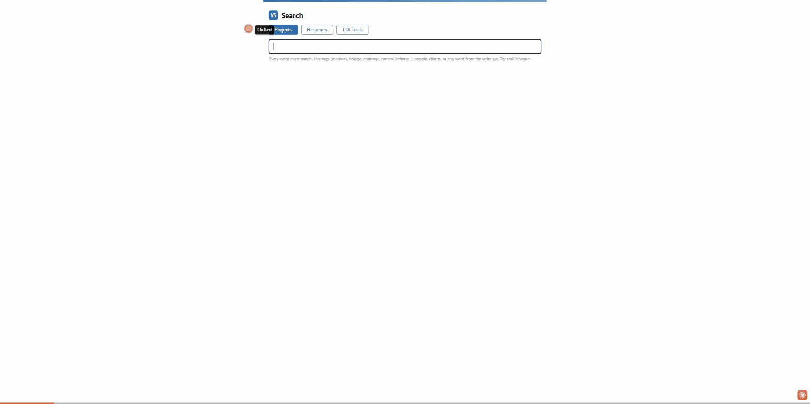

# Proposal Automation

*This is a public showcase copy of an internal VS Engineering tool. Real
client data, resume/project content, and individual staff names have been
removed or replaced with placeholders - the code and workflow are real,
the private company data behind it is not.*

Tools to save the proposal coordinator time on LOIs.

## See it in action

That's the real server, running against fake sample data (demo_data/) instead
of real company files - a couple of made-up resumes and project profiles.
To run it yourself:

    py -m pip install -r requirements.txt
    py -m src.resumes index demo_data/resumes
    py -m src.profiles index demo_data/profiles
    py demo_data/run_demo_server.py

Then open the address it prints in the console. The LOI Tools tab is in there too - upload
demo_data/Sample-Draft-LOI.pdf and it'll catch the wrong RFP number and
typos planted in it. The AI comparison half needs an Anthropic API key to
actually run (see the LOI comparison section below), so it's not in the demo.

## Status

1. Project + resume search - DONE
2. PDF mistake checker - DONE
3. Meeting notes from recordings - not started
4. Deadline reminders - not started
5. LOI comparison vs INDOT winners - built, needs an API key to run

`src/main.py` is an old proposal drafter, ignore it.

## How the pieces fit together

- **Search** - find people and past projects to reuse while writing an LOI.
- **Check** (tool 2) - catch mistakes in a finished LOI before it goes out.
- **Compare** (tool 5) - see why a winning firm's LOI scored better than ours.
- **Review** - runs Check and Compare together in one command.

Everyday use: all four live on the same web page (the **LOI Tools** tab
described below) - no command line needed. The commands further down are
for editing checks.yaml/questions.yaml, automation, or troubleshooting.

## Setup

    py -m pip install -r requirements.txt

Use `py`, not `python`.

## Search

Double-click **Search Projects.bat**. Two tabs: Projects and Resumes.
Type "signals" in Resumes to find people with signal experience.
Leave the black window open - closing it stops the search.

Other office computers: use the address shown in the black window.
First time, click Allow on the firewall popup.

Remote users: need the VPN, or just copy this folder to their laptop
and run it there.

To host it on an office PC: run **Setup Server.bat** once as
administrator. After that it starts itself on every boot, even with
nobody signed in.

When files change on the drives, double-click **Update Index.bat**.

Wrong tags on projects: edit the word lists in `tags.yaml`.
Resume folders starting with `_` (old stuff, people who left) are skipped.

## LOI Tools tab (check + compare, on the same web page)

The **LOI Tools** tab on that same search page runs the mistake checker
and the comparison tool - no command line, no drag-and-drop, no digging
through `output\`. Everyone with the search page URL can use it, including
remote staff over VPN.

1. Add the LOI PDF.
2. Hit Check & Compare. It checks the PDF for mistakes, then compares it
   against every ranked competitor for that same RFP/item - reads out live
   as it works, since the AI comparison takes a minute or two.
3. Results show right on the page: the mistake-check findings, and each
   comparison report in full, with a "Download as Word doc" link if you
   want to save or forward it.

Which pursuit to compare against isn't picked manually - it's guessed from
the RFP/item number in the file's own name (the same way the mistake
checker already guesses it). If a filename doesn't have both numbers in it,
rename it (e.g. "RFP 2605 Item 5 LOI.pdf") or use the RFP/Item override
fields under "More options."

This is the same src.review under the hood - see below for what it's
actually doing and the command-line version (which does let you pick the
pursuit and rank manually, for benchmarking a draft against a different
past pursuit than its own).

## Mistake checker (tool 2)

Drag a finished LOI PDF onto **Check LOI.bat** before it goes out.
Catches wrong RFP/item numbers, wrong client names, doubled words,
page limit, and likely typos. It found a real one: "RFP 2506" in every
footer of our 2605 LOI.

Command line:

    py -m src.check "path\to\LOI.pdf" --client INDOT --max-pages 12

False alarms: add the word to `checks.yaml` and it stays quiet.
VS staff names are already quiet (pulled from the resume index).

## LOI comparison (tool 5)

Compares our LOI against a competitor's, section by section, using AI.
Same questions every run (edit `questions.yaml`). Scores stay out of the
prompt to avoid bias.

    py -m src.compare "2605 Item 5"                # vs the winner (default)
    py -m src.compare "2604 Item 4" --against 2      # vs 2nd place
    py -m src.compare "2605 Item 5" --against all    # vs every ranked competitor

For a draft LOI that hasn't been submitted or scored yet, use `--vs` to
point at it, and pick whichever finished pursuit is the closest match to
benchmark against:

    py -m src.compare "2605 Item 5" --vs "C:\path\to\draft-loi.pdf"

Everything for a pursuit lands together in `output\<pursuit slug>\`, as a
Word doc (double-click to open) plus a matching `.md` file. Needs an
Anthropic API key once (console.anthropic.com, runs cost cents):

    setx ANTHROPIC_API_KEY "sk-ant-..."

Source files come from the marketing team's folder, copied to
`reference/proposal-analysis/`. When they add a new pursuit, copy it in
with the same layout (Competitors/<rfp> Item <n>/, VS Proposals/).

## Review - check and compare together (src/review.py)

Runs the mistake checker and the comparison tool in one go, so you don't
have to run tools 2 and 5 separately. Or double-click **Review Pursuit.bat**.

    py -m src.review "2605 Item 5"
    py -m src.review "2604 Item 11" --vs "C:\path\to\draft-loi.pdf"

With `--vs`, the mistake checker still checks the draft's own real
RFP/item numbers (guessed from its filename, or pass `--rfp`/`--item`) -
not the pursuit you're benchmarking against. A draft for a new RFP
shouldn't get flagged for not matching an old pursuit's number.

## Reference

`reference/` - not in git. Go/no-go policy, example LOIs, RFPs, and
the marketing team's proposal analysis folder.
